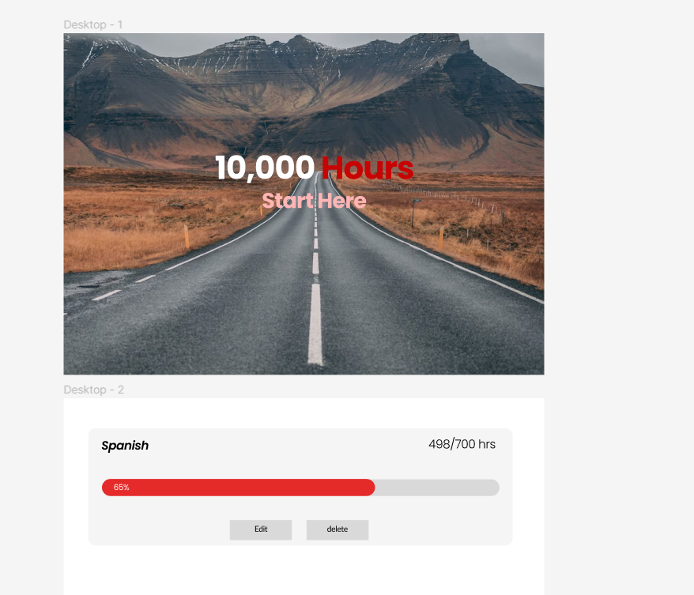
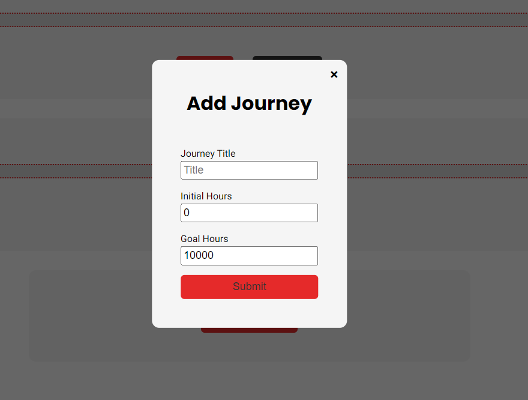

# 10,000 hours project: Development

This is a project that I wanted to create to keep track of my progress of goals over time. I didn't really see anything else like this online (there are only habit trackers), so I decided to make my own simple tool version of this. I really like having a visual confirmation of my progress in my dreams and goals rather than just changing the number in a bland text document.

This code is based primarily on React and is a way for me to get back into using React. I primarily chose react because this is a highly interactive UI project that includes javascript for modals, adding cards, etc. Using server-side rendering for node would require separate pages for everything and would require a lot more bulky vanilla javascript to make actually good. I love Node, but I feel a JavaScript intense project like this where the user can edit their goals without leaving the page requires a framework like React. Hence why I chose it.

## Step 1: Figma Design

I created the visualization of my design on Figma. Later I would go on to experiment with SVG curves, for now I was happy with my minimalist design. I used my knowledge of web design to create this.

- To speed up page loading times, I optimized my images and decreased their file sizes.

## Step 2: creating the UI

### React Router

Initialize react router in the project in case I want to add more pages.

### Styling

I am using SASS to style my React app because of its DRY implementation. I use the Watch SASS extension to compile my scss code into css, and then I use that single css file to style my entire app.

- I use partials to separate my code
- I use nesting to organize my styles

### Navbar

The navbar was simple to make, all I did was use flexbox for the styling and create logos and links to fill the navbar.

### Progress Section

I decided to make the progress section a section full of cards, which would each contain a progress bar, the title of the journey, the number of hours, and the edit buttons.

## Step 3: Card data functionality

The steps to implement card data functionality were as follows:

1. Create a way for the user to add a journey.
2. Create a way for the user to edit a journey.
3. Create a way for the user to delete a journey.

### Adding a journey

I wanted the user to click on an add journey button, which would then render a modal that has a form to add the cards. I quickly realized the tools that I would need for this task:

- Context: to store cards and card data
- Firebase Realtime Databse: to store and fetch data between reloads
- React Portals: to render modals

So I created the `CardContext.js` and set up an `addCard()` function.

This worked fine, and successfully added cards, but I needed to store the journey. Which is where Context along with Firebase. I used the Firebase API to create a dummy route connecting to firebase.
